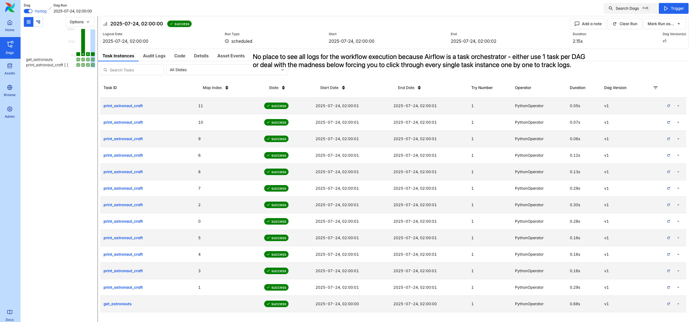
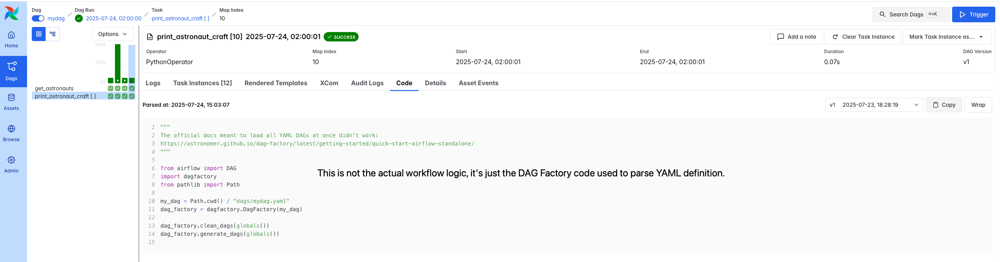

# Migrating from Airflow's DAG Factory to Kestra

This repository demonstrates how to migrate workflows from Apache Airflow (including DAG Factory pattern) to Kestra, showcasing different approaches and patterns for data orchestration.

## Overview

This project contains a practical example of migrating an ETL workflow that retrieves information about astronauts currently in space from the Open Notify API. The same workflow is implemented in multiple ways:

- **Airflow with TaskFlow API** - Python-based approach
- **Airflow with DAG Factory** - YAML-driven configuration pattern
- **Kestra** - Multiple implementation patterns showing different migration approaches

## Repository Structure

```
├── airflow/                       # Airflow implementations
│   ├── dags/
│   │   ├── etl_dag.py             # TaskFlow API implementation
│   │   ├── generate_dag.py        # DAG Factory loader
│   │   └── mydag.yaml             # Example DAG created with DAG Factory
│   └── include/tasks/             # Shared Python functions
├── kestra/                            # Kestra implementations
│   └── flows/
│       ├── etl.yaml                   # Basic HTTP + map pattern
│       ├── etl_python.yaml            # Single Python script approach
│       ├── etl_python_with_map.yaml   # Python + map pattern
│       ├── etl_with_subflow.yaml      # Subflow pattern for modularity
│       └── dag_factory.yaml           # DAG factory pattern equivalent
```

## Workflow Description

The example workflow performs the following steps:

1. **Fetch Data**: Retrieves current astronaut data from `http://api.open-notify.org/astros.json`
2. **Process Data**: Extracts astronaut names and their spacecraft information
3. **Dynamic Processing**: Uses dynamic task mapping/looping to process each astronaut individually
4. **Output Results**: Logs information about each astronaut and their craft

## Airflow vs. Kestra: Key Differences

### Configuration Approach

**Airflow DAG Factory:**

**Needs to define both** the YAML configuration and the Python functions separately, which can lead to inconsistencies (e.g. when you rename some variable or task ID, you need to change it in both places). The same is true for managing any Python code: in theory, you define your Python functions in a separate file, but you still need to hardcode the function names in the YAML configuration. If you later decide to change the function name, you need to update it in both the Python file and the YAML configuration -- seems very error-prone.

```yaml
  tasks:
    print_astronaut_craft:
      operator: airflow.operators.python.PythonOperator
      python_callable_name: _print_astronaut_craft
      python_callable_file: /usr/local/airflow/include/tasks/print_astronaut_craft.py
      partial:
        op_kwargs:
          greeting: "Hello! :)"
      expand:
        op_args: get_astronauts.output
      dependencies: [get_astronauts]
```      

Passing data between tasks seems similarly error-prone e.g. `op_args: get_astronauts.output` follows some DSL with no autocompletion or syntax validation for it. Testing this was only possible with brute force try-and-error.


**Kestra:**

Uses a single self-contained YAML file for the entire flow, including task definitions and configurations, making it easier to manage (e.g. when you rename some variable or task ID, you only need to change it in one place without having to worry about some code that could get out of sync).

You can define Python functions directly inline in your Python task or leverage Namespace Files. You can manage all that from the UI.

There's autocompletion and syntax validation for all tasks as well as input and output variables, making it more efficient to catch errors with confidence without having to rely on brute force try-and-error.


### Dynamic Task Mapping

**Airflow (TaskFlow API):**
```python
print_astronaut_craft.partial(greeting="Hello! :)").expand(
    person_in_space=get_astronauts()
)
```

**Airflow (DAG Factory):**
```yaml
expand:
  op_args: get_astronauts.output
partial:
  op_kwargs:
    greeting: "Hello! :)"
```

**Kestra:**

You simply add a task that loops over specified values. The values can be passed dynamically based on output of previous task. The Debug Expression console in the UI makes it easy to troubleshoot the expressions and see what values will be passed to any task.

```yaml
- id: for_each
  type: io.kestra.plugin.core.flow.ForEach
  values: "{{ outputs.get_astronauts.vars.list_of_people_in_space }}"
  tasks:
    - id: print_astronomer
      type: io.kestra.plugin.core.log.Log
      message: "{{ fromJson(taskrun.value).name }} is flying on {{ fromJson(taskrun.value).craft }}"
```

Finally, the logs view is much easier to navigate as you can see all logs in one place without having to navigate through every single task instance as it's the case in Airflow. If you loop/map over a lot of values, navigating through the logs in Airflow is tedious, while in Kestra you can see all logs in one place.

## Migration Patterns

### 1. Direct HTTP Requests
- **Airflow**: Requires Python code with requests library
- **Kestra**: Built-in HTTP plugin with automatic response handling and easy way to add headers, query parameters, body content and retries for flaky APIs

### 2. Task Dependencies
- **Airflow**: Implicit through function returns or explicit `dependencies` array; sometimes requires double definition when using DAG Factory
- **Kestra**: Implicit through tasks order or explicit through DAG task

### 3. Error Handling & Retries
- **Airflow**: Configured in `default_args` or task-level parameters
- **Kestra**: Built-in `retry` configuration with multiple strategies

### 4. Data Passing
- **Airflow**: XCom for data passing between tasks
- **Kestra**: Automatic output capture and templating system

## Advantages of Each Approach

### Airflow DAG Factory

✅ Possible to define task dependencies in Python

✅ An older tool, thus in some ways more mature ecosystem

✅ Larger OSS community, wider variety of documentation

❌ That larger source of possible documentation is a double-edged sword, as the downside is that you need to sift through a lot of outdated documentation and examples that are not relevant anymore or poor quality examples with no single ownership

❌ Complex setup with multiple separate Python files  

❌ No built-in autocompletion or syntax validation for YAML configuration

❌ Duplicated management of Python functions and YAML configuration

❌ Error-prone due to separate Python and YAML definitions, easy to break simply by renaming a function name; no true separation of business logic and configuration, as in the end they are tightly coupled together

❌ No way to see the actual workflow execution logs in one place, you need to navigate through each task instance separately, which is tedious when you have a lot of tasks or when you loop/map over a lot of values



❌ When you rely on the DAG Factory method, you can't see the actual workflow code from the UI; instead, you only see the DAG Factory code used to parse the YAML definition



### Kestra

✅ Everything-as-code: entire flow can be defined in a single, portable YAML file

✅ Rich built-in plugin ecosystem that works out of the box without having to install and manage any additional Python packages

✅ Intuitive templating system that allows you to use variables and expressions in a simple and easier to debug way

✅ Built-in autocompletion and syntax validation in the YAML Editor

✅ True separation of business logic and configuration, as everything is defined in a single YAML file and your business logic can **optionally** be separated out into fully independent Namespace Files; there's no coupling between the two, so you can change your business logic without having to worry about breaking the flow configuration

❌ Not possible to define task dependencies in Python, declarative language-agnostic YAML definition is used instead

❌ Some extra learning curve for Airflow users (albeit the syntax is straightforward and the flow can be defined also from No-Code or from built-in AI agent)

## Getting Started

### Running the Airflow Example
```bash
brew install astro
astro dev start
# Access Airflow UI at http://localhost:8080
```

### Running the Kestra Example
```bash
cd kestra
docker-compose up -d
# Access Kestra UI at http://localhost:8082 and import flows.zip
```

## Migration Strategy

When migrating from Airflow DAG Factory to Kestra:

1. **Start Simple**: Begin with the basic HTTP + ForEach pattern
2. **Preserve Logic**: Move Python functions into Kestra Script tasks
3. **Leverage Built-in Plugins**: Replace custom operators with Kestra plugins whenever possible as you benefit from faster runtime and easier dependency management
4. **Optimize**: Use Kestra's native features for better performance e.g. add `concurrencyLimit: 0` to ForEach tasks to run all iterations in parallel or set it to a specific value e.g. `concurrencyLimit: 10` to limit concurrency to 10 mapped/looped tasks at a time
5. **Test**: Validate outputs match your Airflow implementation

This repository serves as a practical guide for teams looking to modernize their data orchestration stack from Airflow to Kestra.
